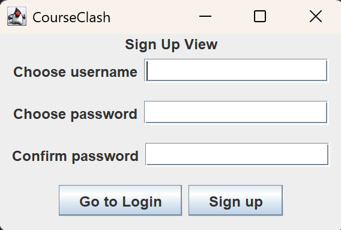
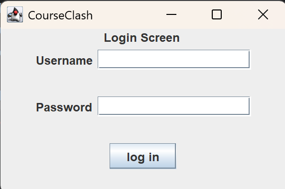
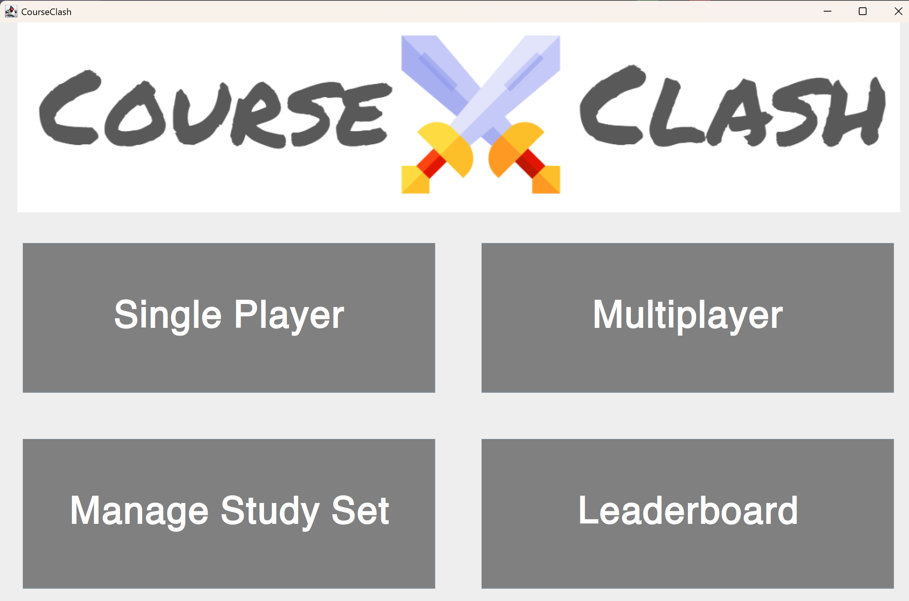
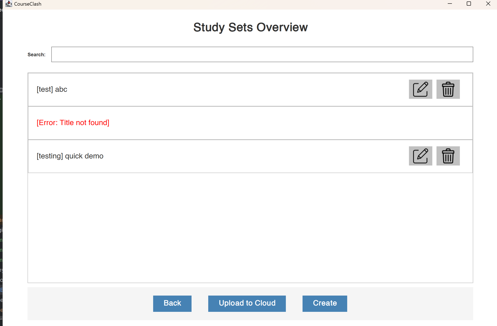
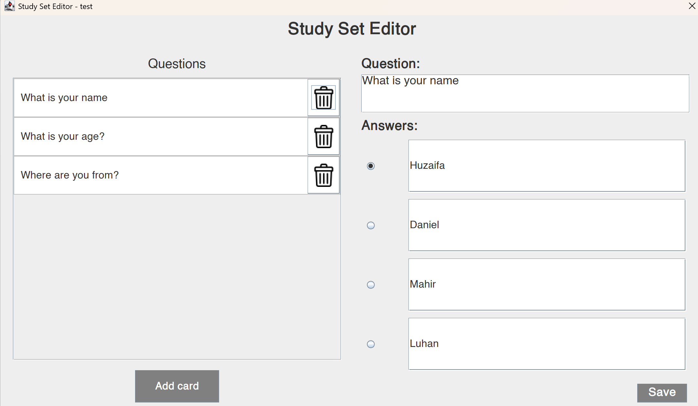
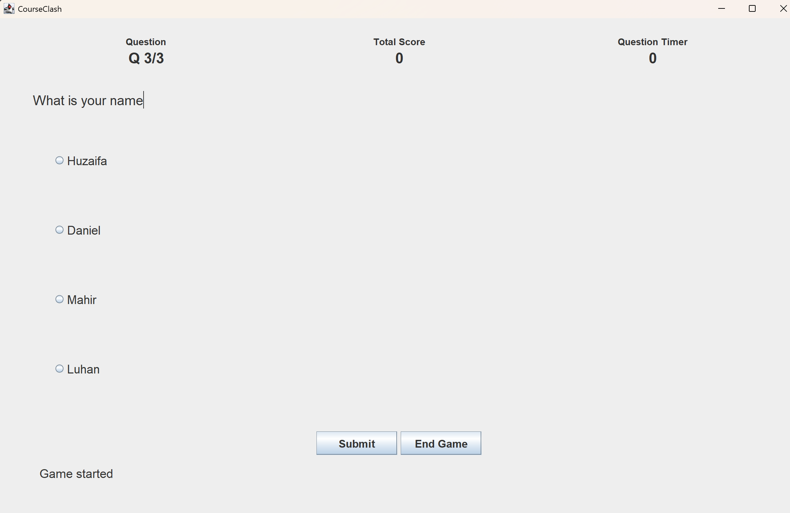
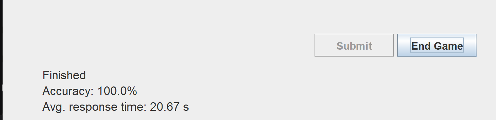

📚 CourseClash — Team Project

CourseClash is an educational quiz-based application designed to help students study course material through Single Player and Multiplayer game modes.
Users can browse study sets, play timed quizzes, compete on leaderboards, and track their performance over time.

🚀 Summary of Application
CourseClash allows university students to:

- Select or create study decks
- Play quizzes in Single Player or Multiplayer modes
- Earn score based on correct answers and response speed
- View analytics such as accuracy, average response time, and questions answered
- Compare performance with other users via dynamic leaderboards
- Save results through a backend powered by APIs & persistent storage

Built following Clean Architecture, the project cleanly separates:

Entities
Use Cases (Interactors)
Interface Adapters (Controllers, Presenters, ViewModels)
Frameworks & Drivers (Swing UI, Data Access, API Clients)

👤 User Stories & Responsibilities

1- As a user, I want to sign in and access my account
- Responsible: Daniel
- Status: Completed
- Description: Basic account & session management

2- As a user, I want to browse/create/edit/delete study decks.
- Responsible: Archie
- Status: Completed
- Description: Deck selection, filtering, retrieval, creation, manipulation, and deletion.

3 - As a user, I want to play Single Player mode.
- Responsible: Huzaifa
- Status: Completed
- Description: Starting game, answering questions, score/accuracy, ending game

4 - As a user, I want to compete in Multiplayer mode.
- Responsible: Mahir
- Status: Completed
- Description: multiplayer game: selecting answers, displaying scores etc..

5 - As a user, I want to connect peer-to-peer severs in Multiplayer mode.
- Responsible: Luhan
- Status: Completed
- Description: Socket connection, syncing between players

6 - As a user, I want to compare my performance with others using leaderboards.
- Responsible: Albert
- Status: Completed
- Description: View leaderboard by category

API INFORMATION

1. Gemini API Client (for generating AI study questions)

Used to generate alternative incorrect answers
Used when creating or modifying a study deck
Integrated through frameworks_and_drivers/AIServices/GeminiApiClient.java

2. Internal Server API (Saving Game Results & User Stats)

Used to:

Save Single Player game results
Fetch leaderboard data
Retrieve user experience points, level, etc.

3. Web-based Endpoint for Multiplayer

Used to coordinate:
Player connections
Real-time question synchronization
Answer submissions

SCREENSHOTS TO SHOW FUNCTIONALITY:

Please keep this up-to-date with information about your project throughout the term.

The readme should include information such as:
- a summary of what your application is all about
- a list of the user stories, along with who is responsible for each one
- information about the API(s) that your project uses 
- screenshots or animations demonstrating current functionality
By keeping this README up-to-date,
your team will find it easier to prepare for the final presentation
at the end of the term.
